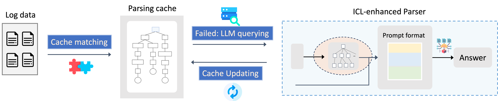

# LILAC: Log Parsing using LLMs with Adaptive Parsing Cache

This is the replication package for [FSE24]["LILAC: Log Parsing using LLMs with Adaptive Parsing Cache"]().

In this paper, we propose LILAC, the first practical LLM-based log parsing framework.
LILAC consists of two main components: the ICL-enhanced Parser and the adaptive parsing cache.



The detailed parsing time can be found in [detailed parsing time for RQ4](figures/parsing_time.png).

If you find our paper benefit your research, please kindly cite our related paper:

- Zhihan Jiang, Jinyang Liu, Zhuangbin Chen, Yichen Li, Junjie Huang, Yintong Huo, Pinjia He, Jiazhen Gu, Michael R. Lyu. [LILAC: Log Parsing using LLMs with Adaptive Parsing Cache]() FSE, 2024. 

- Zhihan Jiang, Jinyang Liu, Junjie Huang, Yichen Li, Yintong Huo, Jiazhen Gu, Zhuangbin Chen, Jieming Zhu, Michael R. Lyu. [A Large-scale Benchmark for Log Parsing.](https://arxiv.org/abs/2308.10828) Arxiv, 2023. 


## Repository Organization 

```
├── full_dataset/ # Please download and unzip full datasets into this directory
│   └── sampled_examples # Our saved sampled candidates
├── benchmark/
│   ├── evaluation/ # the evaluation code of LILAC
│   └── logparser/ # the implementation code of LILAC
├── result/
│   └── ...... # contains the saved evaluation files
├── sampling/ # the implementation of candidate sampling algorithms
│   ├── logppt_sampling.py # the sampling algorithm of LogPPT
│   └── LILAC_sampling.py # the sampling algorithm of LILAC
├── requirements.txt
├── openai_key.txt # the OpenAI api address and key
└── README.md
```


## Quick Start

### Datasets

Please first download the large-scale datasets for log parsing in LogPub from [Zenodo](https://zenodo.org/record/8275861) and unzip these datasets into the directory of `full_dataset`.

###  Installation

1. Install ```python >= 3.8```
2. ```pip install -r requirements.txt```


### Execution

- Candidate Sampling (optional)

    We have provided the saved sampled candidate logs for reproducing.

    One can also delete the `full_dataset/sampled_examples` and execute the LILAC's sampling algorithm as follows:

    ```bash
    cd sampling/
    python LILAC_sampling.py
    ```

- Online Log Parsing

    Please first add an OpenAI API key (`sk-xxxx`) into the second line of openai_key.txt.

    We provide a one-click script to run LILAC for online log parsing.

    ```bash
    ./online_parsing.sh
    ```

    One can also go to `benchmark/evaluation` and execute:

    ```bash
    python LILAC_eval.py --shot [candidates] --example_size [demonstrations] --model [model]
    ```

The parsed results and evaluation results will be saved in the `result/` directory.

We have provided the saved evaluation metric files of LILAC with different settings in the directory of `result/`.